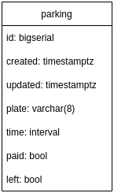

# test-backend

Projeto criado como avaliação para a vaga Backend Python/Django da Seplag.

## Descrição do teste

Veja o arquivo [test-backend.pdf](static/test-backend.pdf)

## Diagrama de tabelas



Acima podemos ver o diagrama da tabela `parking` criada para armazenar os dados do estacionamento

## Execução
O projeto utiliza [Docker](https://www.docker.com/) e [Makefile](https://www.gnu.org/software/make/), logo, basta executar:

```sh
make run
```
Este comando gerar um build e subir os containers definidos no arquivo `docker-compose.yml`.

## Testando
Para rodar os testes, execure o comando abaixo:
```sh
make test
```
